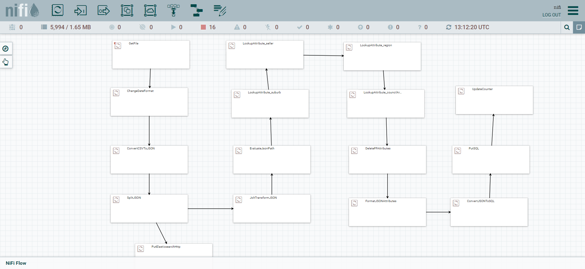

# Melbourne Housing Dataset Data Pipeline Project

## Overview

This project aims to provide a robust and efficient ETL (Extract, Transform, Load) pipeline alongside data visualization capabilities to analyze the Melbourne housing market. The pipeline is designed to extract data from a CSV source, perform requisite transformations, and load it into PostgreSQL and Elasticsearch databases. Insights from the processed data are visualized using Kibana.

The project is built on Apache Nifi for data ingestion and is containerized for easy deployment via Docker and Docker-Compose.

## Dataset Information

The dataset is acquired from Domain.com.au and updated weekly. It contains various attributes such as Address, Type of Real Estate, Suburb, Method of Selling, Number of Rooms, Price, Real Estate Agent, Date of Sale, and Distance from the Central Business District (C.B.D).

[Download dataset here](https://www.kaggle.com/datasets/anthonypino/melbourne-housing-market)

## Technologies Used

- python - version 3.9.15
- docker - version 24.0.2
- docker-compose - version 2.19.1
- Python - version 3.9.15
- Apache Nifi - version 1.13.2
- PostgreSQL - version 13.3
- pgAdmin - version 4.30
- ElasticSearch - version 7.6.0
- Kibana - version 7.6.0

## Architecture

1. Data Normalization: Using Python, attributes like suburb, method of selling, and type of real estate are normalized and lookup tables are created.
2. Data Ingestion: Apache Nifi is used for data ingestion from the data lake, simulated by a directory.
   
3. Data Storage: The cleaned and transformed data is stored in a PostgreSQL database.
4. Data Indexing: Simultaneously, the cleaned data is indexed in Elasticsearch for faster queries.
5. Data Visualization: A dashboard is set up in Kibana to display trends and insights to end-users.
   

## Getting Started

### Prerequisites
- Python 3.9.15 or above
- Docker 24.0.2 or above
- Docker-Compose 2.19.1 or above

### Installation Steps

1. **Clone this Repository**
    ```bash
    git clone https://github.com/yourusername/melbourne-housing-data-pipeline.git
    ```
2. **Activate Python Virtual Environment**
    ```bash
    source venv/bin/activate
    ```
3. **Install Docker and Docker-Compose**
    - Follow the installation guide for your system [here for Docker](https://docs.docker.com/get-docker/) and [here for Docker-Compose](https://docs.docker.com/compose/install/).

4. **Run Docker-Compose**
    ```bash
    docker-compose up
    ```
5. **Access Kibana Dashboard**
    - Open your browser and navigate to [http://localhost:5601](http://localhost:5601) to access the Kibana dashboard.
